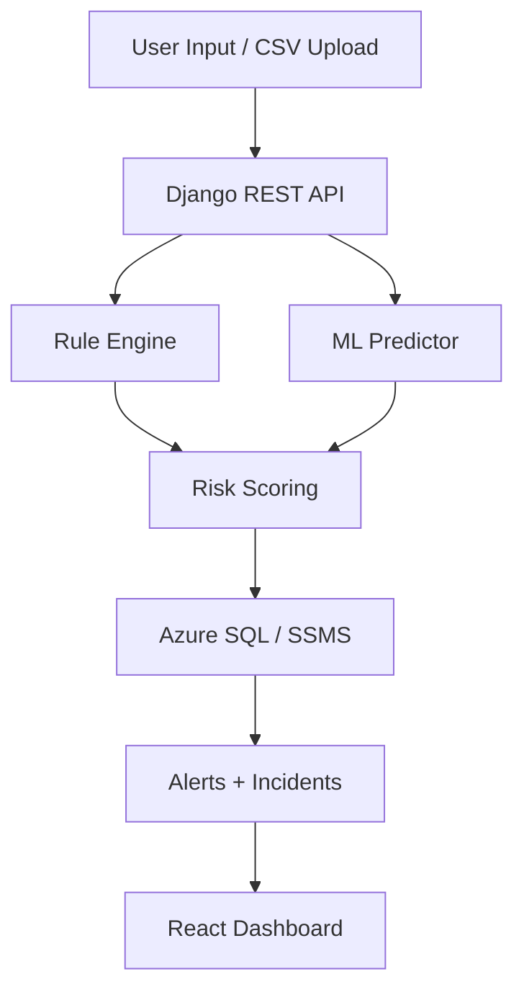

# System Flow (Mermaid)

```mermaid
graph TD
    A[User Input / CSV Upload] --> B[Django REST API]
    B --> C[Rule Engine]
    B --> D[ML Predictor]
    C --> E[Risk Scoring]
    D --> E[Risk Scoring]
    E --> F[Azure SQL / SSMS]
    F --> G[Alerts + Incidents]
    G --> H[React Dashboard]
```
